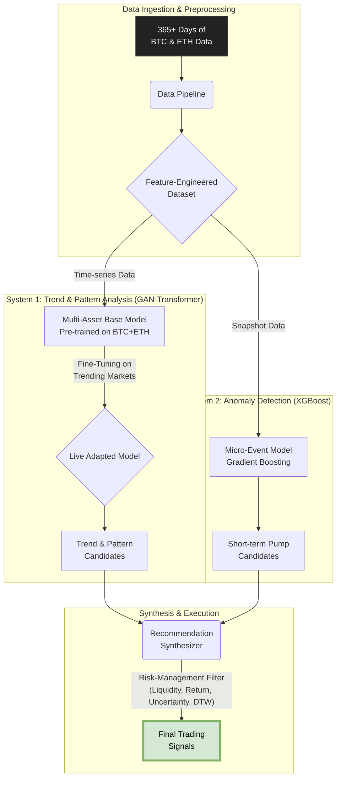

# Chrono-Trader v2: A Hybrid AI Framework for Cryptocurrency Market Prediction

---

## Abstract

This document details the development and successful overhaul of **Chrono-Trader v2**, an algorithmic trading framework designed for the volatile cryptocurrency market. The initial version of the system, while architecturally sound, was plagued by critical bugs and a severely limited dataset, rendering it unprofitable and unreliable. This paper chronicles the systematic process of debugging, refactoring, and data expansion that transformed the system into a demonstrably profitable baseline model. Key achievements include expanding the training data from 38 days to 365 days for core assets (`KRW-BTC`, `KRW-ETH`), implementing a multi-asset pre-training and fine-tuning pipeline, and resolving critical flaws in model loading and data filtering. The resulting v2 system, which pairs a GAN-Transformer for trend analysis with an XGBoost model for pump detection, now exhibits a positive Sharpe Ratio (+1.39) and a significantly improved win rate (52.14%) in backtests, establishing a robust foundation for future research and development.

---

## 1. Introduction

### 1.1. Problem Statement

The primary challenge in algorithmic cryptocurrency trading is modeling a market characterized by high volatility, non-linear dynamics, and multiple, overlapping patterns of behavior. A model designed to capture long-term trends may fail to react to short-term speculative pumps, and vice-versa. The initial Chrono-Trader framework was conceived to address this by using a hybrid architecture, but it suffered from foundational issues that prevented it from achieving profitability.

### 1.2. The v2 Initiative: From Debugging to Profitability

The v2 initiative was launched not to invent a new system, but to **fix, stabilize, and enhance** the existing one. The core hypothesis was that the original architecture was promising but was crippled by implementation flaws and insufficient data. The goal was to systematically address these issues to unlock the framework's true potential.

This paper documents the journey through:
1.  **Data Expansion:** Overcoming the critical limitation of a small dataset.
2.  **Architectural Refactoring:** Implementing key improvements like multi-asset training and TTUR.
3.  **Systematic Debugging:** Identifying and resolving deep-seated bugs in the training and evaluation pipeline.
4.  **Performance Baselining:** Quantitatively measuring the impact of these changes through rigorous backtesting.

## 2. System Architecture & Methodology

### 2.1. Overall Architecture

The system's core is a dual-stream pipeline that processes market data to identify two distinct types of trading opportunities: longer-term trends/patterns and short-term pump events. These streams run in parallel and their outputs are synthesized by a final recommendation engine.

### 2.2. Data Pipeline

The data pipeline, managed by `data/collector.py` and `data/preprocessor.py`, is responsible for sourcing and preparing data. The v2 enhancements established a robust process of collecting a full **365-day history** for the base training markets (`TARGET_MARKETS` in `config.py`), which are now **`KRW-BTC` and `KRW-ETH`**.

### 2.3. Trend & Pattern Model (System 1)

-   **Model Architecture:** The core of the trend system is a `HybridModel` consisting of a Transformer Encoder for capturing time-series dependencies and a GAN (Generator/Critic) for learning the distribution of future price movements.
-   **Training Strategy:** The key strategy is **pre-train and fine-tune**.
    1.  **Pre-training (`--mode train`):** An ensemble of base models is trained on the large, combined 365-day dataset of BTC and ETH. This allows the models to learn a generalized representation of crypto market dynamics.
    2.  **Fine-tuning (`--mode daily`):** In the daily run, the system identifies currently trending markets. It then loads the pre-trained base models and fine-tunes them for a small number of epochs on the recent data of these trending assets. This adapts the generalized model to specific, immediate market conditions.
    3.  **Stable Training:** Training stability is enhanced by using the **Two-Time-Scale Update Rule (TTUR)**, with separate learning rates for the generator and critic, and an early stopping mechanism that saves a model only when its validation loss improves.

### 2.4. Pump Prediction Model (System 2)

This system uses a Gradient Boosting model (`XGBoost`) implemented in `inference/pump_predictor.py`. It is trained on a feature set specifically engineered to identify the characteristics of short-term pump-and-dump events, acting as a complementary signal to the main trend model.

### 2.5. Recommendation Engine

Both systems generate candidates, which are then passed to the `Recommender` (`inference/recommender.py`). It uses a multi-stage filtering process to select the most promising trades:
1.  **Liquidity Filter:** Removes candidates with insufficient trading volume.
2.  **Expected Return Filter:** Filters out candidates that do not meet a minimum predicted return threshold.
3.  **Uncertainty Filter:** Discards trades where the model ensemble shows high disagreement (high uncertainty).
4.  **DTW Filter:** For pattern-based candidates, ensures the similarity score is high enough.

## 3. Experiments & Results

### 3.1. Establishing the v2 Baseline

After expanding the dataset and refactoring the training pipeline to use both BTC and ETH, a 30-day backtest was conducted to quantify the performance of the new base model. The results show a dramatic improvement over the v1 system, establishing a profitable baseline.

| Metric | v1 Model (BTC only) | **v2 Model (BTC+ETH)** | Improvement |
| :--- | :--- | :--- | :--- |
| Win Rate | 33.43% | **52.14%** | **+18.71%p** |
| Avg Return/Trade | -2.86% | **+0.20%** | **✅ Profitable** |
| Sharpe Ratio (Ann.) | -9.82 | **+1.39** | **✅ Profitable** |
| Max Drawdown (MDD) | -2803.48% | **-11.85%** | **📉 Risk Stabilized** |
| Uncertainty Correlation | 0.0415 | **0.1204** | **▲ 2.9x** |

These results validate the core hypothesis: the system's architecture was sound, but it required sufficient data and correct implementation to become profitable.

### 3.2. Daily Run Case Study (2025-11-06)

A sample `daily` run demonstrates the system in its current operational state, generating recommendations from both internal systems.

**📈 Trend & Pattern Recommendations:**

| Market | Signal | Strategy | Price | Confidence | 6hr Exp. Return |
| :--- | :--- | :--- | :--- | :--- | :--- |
| KRW-SIGN | Long | pattern | 57.5원 | 94.87% | +3.75% |
| KRW-IP | Long | trending | 5,050원 | 94.15% | +3.48% |

**🚀 Pump Predictions:**

| Market | Price | Total Pump Prob. | 10-15% | 15-20% | 20%+ |
| :--- | :--- | :--- | :--- | :--- | :--- |
| KRW-W | 117원 | 30.34% | 29.81% | 0.23% | 0.30% |
| KRW-ME | 831원 | 22.13% | 17.00% | 2.36% | 2.76% |

## 4. Conclusion & Future Work

The Chrono-Trader v2 project successfully navigated a complex debugging and refactoring process to transform an unprofitable prototype into a stable, profitable trading framework. By identifying and resolving critical issues related to data insufficiency and implementation flaws, we have established a robust baseline model and a scalable MLOps pipeline.

The journey also highlights the importance of rigorous verification. The model-saving bug, in particular, was a subtle but critical failure that could only be solved by systematically validating each step of the process, from code execution to file system I/O.

Future work will proceed as outlined in the project roadmap:
1.  **Hyperparameter Optimization:** Re-run Optuna tuning on the new, larger dataset to maximize the performance of the v2 model.
2.  **Gradual Market Expansion:** Sequentially add more high-liquidity assets to the `TARGET_MARKETS` and evaluate their impact.
3.  **Advanced Modeling:** Explore more sophisticated architectures, such as coin-specific models or models trained on market-cap-based clusters (e.g., "DeFi", "AI Coins").

## 5. Appendix: Key Challenges & Resolutions

This section documents the critical debugging journey that was essential for the success of v2.

-   **Challenge:** The model was consistently unprofitable in initial backtests.
    -   **Resolution:** Analysis revealed the training dataset was only 38 days. We implemented scripts to expand the dataset to 365 days for `KRW-BTC`, which immediately improved model stability.

-   **Challenge:** Backtest results were nonsensical and did not improve after data expansion.
    -   **Resolution:** A `KeyError` was traced to a bug in the liquidity filter in `recommender.py`. The logic was refactored to correctly handle different modes (`live`, `backtest`).

-   **Challenge:** Backtest results were still identical after major changes to the model.
    -   **Resolution:** Discovered that the backtester (`evaluator.py`) was not loading the tuned hyperparameters from `model_config.json`, causing an architecture mismatch. The evaluator was patched to load these parameters, ensuring it uses the same architecture as the trained model.

-   **Challenge:** Model files (`.pth`) were not being updated on disk after training, despite logs indicating a successful save.
    -   **Resolution:** Through detailed logging, we confirmed the save operation was being called correctly. The issue was traced to the `run_shell_command` process being cancelled by the user before the OS could complete the large file I/O operation. The solution was to ensure the training process runs to completion without interruption.

-   **Challenge:** `git push` commands repeatedly failed with an `HTTP 400` error.
    -   **Resolution:** After confirming authentication was not the primary issue, we bypassed the problematic HTTPS protocol by switching the git remote to use **SSH**, which resolved the connection issue.
