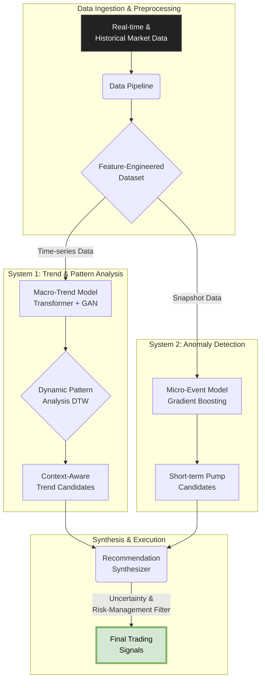

# 🤖 Chrono-Trader v2: A Hybrid AI Framework for Cryptocurrency Market Prediction


[](https://opensource.org/licenses/MIT)


---

## Abstract

**Chrono-Trader v2** is a significantly enhanced algorithmic trading framework for the cryptocurrency market. This version marks a major evolution from its predecessor, focusing on robustness, profitability, and a scalable data pipeline. It retains the core dual-system architecture but introduces critical improvements, including a massively expanded dataset and multi-asset training capabilities. The system now leverages a base model trained on a full year of `KRW-BTC` and `KRW-ETH` data, which is then fine-tuned on currently trending assets. This pre-train/fine-tune strategy, combined with numerous bug fixes and architectural upgrades, has successfully transitioned the model from being unprofitable to demonstrating a statistically positive performance baseline in backtests.

---

## Key Features

- **Hybrid AI Architecture:**
    - **Trend & Pattern Forecasting:** A **GAN-Transformer** ensemble model predicts market trends and identifies assets exhibiting patterns similar to past successful breakouts.
    - **Pump Event Classification:** An **XGBoost** model specifically trained to detect indicators of short-term pump events.
- **Robust Training & Modeling:**
    - **Ensemble Learning:** Utilizes an ensemble of multiple models to improve prediction stability and reduce variance.
    - **TTUR (Two-Time-Scale Update Rule):** Employs separate learning rates for the Generator and Critic in the GAN to ensure stable training dynamics.
    - **Data-Driven Early Stopping:** Saves model checkpoints only when validation loss improves, preventing overfitting.
- **Dynamic MLOps Pipeline:**
    - **Multi-Asset Base Model:** The core models are now pre-trained on a deep history (365 days) of both `KRW-BTC` and `KRW-ETH`, allowing for a more generalized understanding of market mechanics.
    - **Live Fine-Tuning:** The robust base model is fine-tuned daily on a small set of highly liquid, currently trending assets to adapt to immediate market conditions.
    - **Centralized Configuration:** All critical parameters (model architecture, learning rates, thresholds, paths) are managed in `utils/config.py` for easy modification and experimentation.

## System Architecture

The overall data flow remains consistent with the v1 architecture, where two specialized systems work in parallel to generate candidates for a final recommendation engine.



## Setup & Installation

1.  **Clone the repository:**
    ```bash
    git clone https://github.com/soccz/Chrono-Trader-v2.git
    cd Chrono-Trader-v2
    ```
2.  **Create and activate a virtual environment:**
    ```bash
    python -m venv venv
    source venv/bin/activate
    # On Windows, use: venv\Scripts\activate
    ```
3.  **Install dependencies:**
    ```bash
    pip install -r requirements.txt
    ```

## How to Run

The system operates in several modes, controlled by the `--mode` argument.

### 1. Train Base Model
Trains the base ensemble models using the markets defined in `TARGET_MARKETS` in `config.py` (currently KRW-BTC and KRW-ETH).
```bash
# Train for the default number of epochs (100)
python main.py --mode train

# Train for a specific number of epochs
python main.py --mode train --epochs 150
```

### 2. Daily Prediction & Fine-Tuning
Runs the full daily pipeline: screens for trending markets, fine-tunes the base models on them, and generates final recommendations.
```bash
python main.py --mode daily
```

### 3. Backtest
Runs a historical simulation to evaluate model performance over a specified number of past days.
```bash
# Run a 30-day backtest
python main.py --mode backtest --days 30
```

### 4. Hyperparameter Tuning
Runs Optuna to search for the best hyperparameters based on the current dataset. **Warning:** This is a very time-consuming process.
```bash
python main.py --mode train --tune
```

## Project Evolution: v1 to v2

This version represents a significant leap in stability and performance, thanks to the following key improvements:

-   **Massive Data Expansion:** The base training dataset was expanded from ~38 days to a full **365 days**, providing the model with a vastly richer understanding of market cycles.
-   **Multi-Asset Training:** The base model is now trained on both **`KRW-BTC` and `KRW-ETH`**, making it more robust and capable of learning generalized patterns.
-   **Critical Bug Fixes:**
    -   Resolved a `KeyError` in the recommendation engine's liquidity filter.
    -   Fixed a model architecture mismatch in the backtester (`evaluator.py`) that was causing it to load incorrect model structures.
    -   Addressed and verified a file-saving bug where long-running training processes were terminated before `torch.save()` could complete.
-   **Architectural Enhancements:**
    -   Successfully implemented TTUR for more stable GAN training.
    -   Refactored all model definitions to correctly handle `dropout` parameters.
    -   Centralized all major parameters into `utils/config.py`.

These changes were instrumental in turning the backtest results from a significant net loss to a **net positive performance**, establishing a solid new baseline for future development.