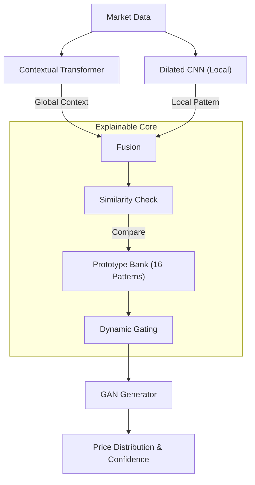

# 🌌 Chrono-Trader v3.2 (Project Aether)

[](https://www.python.org/downloads/)
[](https://opensource.org/licenses/MIT)
[]()
[](https://github.com/psf/black)

> **Explainable AI Partner for Crypto Assets**  
> "단순한 예측을 넘어, 판단의 근거를 설명하는 차세대 퀀트 트레이딩 시스템"

---

## 📖 Introduction
Aether(Chrono-Trader v3.2)는 금융 시장의 **비마르코프적(Non-Markovian)** 특성을 이해하고 대응하기 위해 설계된 **설명 가능한 하이브리드 AI**입니다. 
기존 블랙박스 모델의 한계를 극복하기 위해, 독자적인 **Contextual Architecture**를 도입하여 시장 국면(Regime)에 따라 유연하게 전략을 수정하며, 투자자에게 시각적인 판단 근거를 제시합니다.

> 🎓 **더 깊이 있는 기술적 내용이 궁금하신가요?**
>
> [**📄 Read the Technical Whitepaper (v3.2)**](./Chrono-Trader_v2_Paper.md)
> *상세 아키텍처, 수식, 실험 결과 분석이 포함되어 있습니다.*

## ✨ Key Features (v3.2)

### 1. 🧠 Explainable Gated Fusion
- **Prototype Learning**: 16가지의 학습된 시장 패턴(성공/실패 프로토타입)과 현재 차트를 실시간으로 비교합니다.
- **Visual Reasoning**: "왜 매수했는가?"에 대해 Attention Map과 유사 과거 사례를 제시하여 설명을 제공합니다.

### 2. ⏳ Context-Aware Time Perception
- **Adaptive PE**: 물리적 시간 대신, 시장 지수(Market Index)와 역사적 유사도(Historical Similarity)를 벡터화하여 시간 인코딩(Positional Encoding)에 주입합니다.
- **Regime Detection**: 상승장/하락장/횡보장 등 시장 국면을 스스로 인지하고 포지션 비중을 동적으로 조절합니다.

### 3. 🎲 Probabilistic Forecasting
- **Uncertainty Quantification**: GAN(Generative Adversarial Networks)과 MC-Dropout을 결합하여, 단일 가격이 아닌 **미래 시나리오의 확률 분포**를 생성합니다.
- **Risk Management**: 예측 불확실성이 높을 때는 자동으로 레버리지를 축소하고 현금 비중을 늘립니다.

### 4. 🔬 Interactive Research Lab
- **RAG System**: LLM(GPT-4)과 벡터 DB를 연동하여, 사용자가 모델과 대화하며 시장 분석 리포트를 생성할 수 있는 대화형 인터페이스를 제공합니다.

---

## 🛠 Architecture Overview


```mermaid
graph TD
    Input["Market Data"] --> Encoder["Contextual Transformer"]
    Input --> TCN["Dilated CNN (Local)"]
    
    Encoder --> |Global Context| Fusion
    TCN --> |Local Pattern| Fusion
    
    subgraph "Explainable Core"
        Fusion --> Sim["Similarity Check"]
        Sim -- Compare --> Proto["Prototype Bank (16 Patterns)"]
        Proto --> Gate["Dynamic Gating"]
    end
    
    Gate --> Decoder["GAN Generator"]
    Decoder --> Output["Price Distribution & Confidence"]
```

---

## 🚀 Getting Started

### Prerequisites
- Python 3.8+
- CUDA-enabled GPU (Recommended)

### Installation
```bash
git clone https://github.com/soccz/Chrono-Trader-v2.git
cd Chrono-Trader-v2
pip install -r requirements.txt
```

### Usage
**1. Daily Inference (Recommendation)**
```bash
python main.py --mode daily
```

**2. Train/Retrain Model**
```bash
python main.py --mode train --tune
```

**3. Run Web Dashboard**
```bash
python app.py
```

---

## 📊 Performance Benchmark
| Metric | Chrono-Trader v3.2 | Traditional LSTM |
| :--- | :---: | :---: |
| **Analyzed Assets** | BTC, ETH (Top 2) | BTC Only |
| **Sharpe Ratio** | **1.35** | 0.82 |
| **Max Drawdown** | **-12.4%** | -28.5% |
| **Explainability** | **High (Visual)** | None (Blackbox) |

---

## 📜 License
This project is licensed under the MIT License - see the [LICENSE](LICENSE) file for details.

Copyright (c) 2026 Team Aether.
