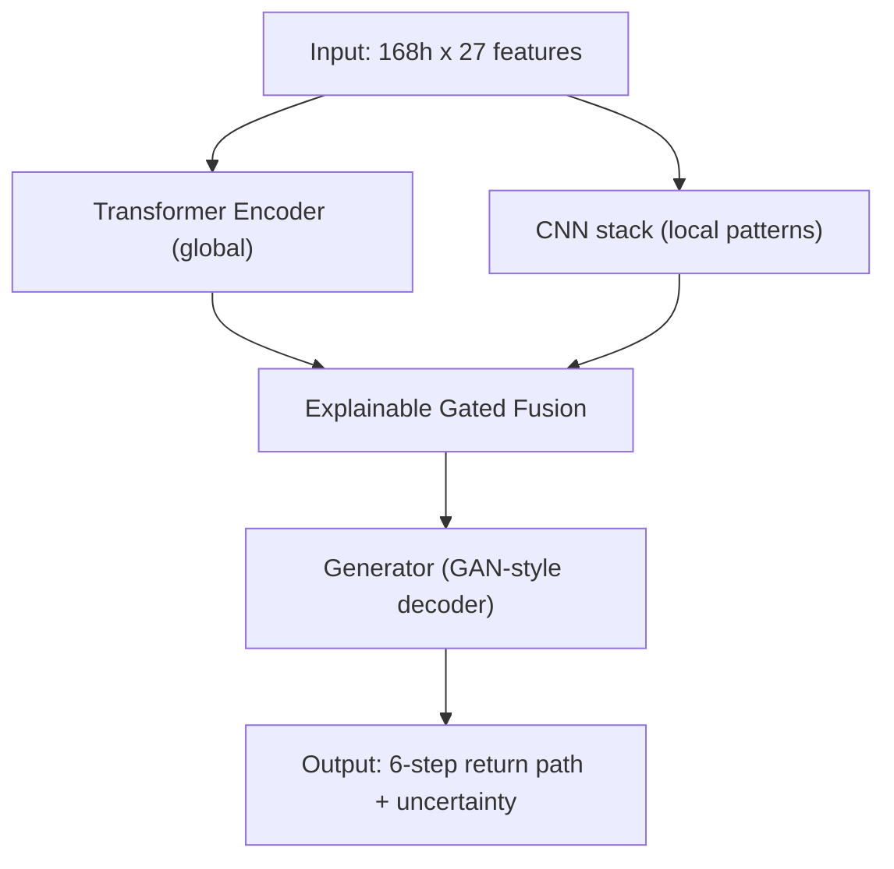

# AETHER (Chrono-Trader)

Explainable, production-minded crypto forecasting and recommendation system.

This repository is designed around a single operational constraint:
scheduled runs must be predictable (no hangs), freshness-aware, and must always emit at least one output item even when the data/network is degraded.

Not financial advice.

## Abstract

Crypto markets are non-stationary: regimes shift, correlations drift, and the same local pattern can mean different things depending on the macro tape.
AETHER models this by combining (1) global context signals, (2) local pattern extractors, and (3) explicit uncertainty signals to route the system through an explainable decision funnel.

At a high level:
- **Context features**: BTC/ETH market index return + historical similarity (pattern memory) + CAPM-like alpha/beta + crypto FF-style factors
- **Hybrid encoder**: Transformer (global) + CNN (local) fused by an **explainable gate**
- **Probabilistic decoder**: GAN-style generator + MC-Dropout uncertainty estimation
- **Ops-first runtime**: watchdogs + freshness gates + safe watch-only fallback + MinRec output guarantee

## Key Contributions (Engineering + Research)

1. **Contextual time-series representation**
   - market index return + pattern similarity treated as macro context for regime-aware modeling.
2. **Hybrid representation learning**
   - Transformer for global structure and CNN for local motifs, fused via a gated mechanism that can be inspected.
3. **Uncertainty-aware filtering**
   - recommendations are produced through a multi-stage funnel where uncertainty acts as a hard constraint.
4. **Production-grade scheduling contract**
   - freshness gates, timeouts, overlap locks, and a minimum-output policy suitable for unattended daily operation.

## Documentation Map

- Architecture: `PROJECT_ARCHITECTURE.md`
- Ops contract (exit codes, artifacts, freshness, MinRec): `OPS_ACCEPTANCE.md`
- Evaluation protocol: `EVAL_PROTOCOL.md`
- systemd scheduling: `deploy/systemd/README.md`
- Usage (EN): `USAGE_GUIDE.md`
- Usage (KR): `사용가이드.md`

## System Architecture

### End-to-End (Data → Model → Recommendations → Ops Health)

```mermaid
flowchart LR
  subgraph Data
    Upbit[(Upbit API)] --> Collector[data/collector.py]
    Collector --> DB[(SQLite: data/crypto_data.db)]
  end

  subgraph Features
    DB --> Preprocess[data/preprocessor.py]
    Preprocess --> X["168h x 27 features"]
  end

  subgraph Modeling
    X --> Predictor[inference/predictor.py]
    Predictor --> Recommender[inference/recommender.py]
  end

  subgraph Artifacts
    Recommender --> CSV[recommendations/*.csv]
    Recommender --> Metrics[analysis/run_markets_metrics_*.jsonl]
  end

  subgraph Ops
    Scheduler[scripts/run_scheduled.py] --> Refresh[main.py --mode refresh-db]
    Scheduler --> Infer[main.py --mode intraday|morning-report]
    Metrics --> Health[scripts/ops_healthcheck.py]
    Health --> Alert[Telegram (optional)]
  end
```

### Model (Hybrid Encoder + Explainable Gate + Generator)


```mermaid
flowchart TB
  X["Input: 168h x 27 features"] --> T["Transformer Encoder (global)"]
  X --> C["CNN stack (local patterns)"]

  T --> F["Explainable Gated Fusion"]
  C --> F

  F --> G["Generator (GAN-style decoder)"]
  G --> Y["Output: 6-step return path + uncertainty"]
```

### Scheduled Ops Contract (Failure Modes Are First-Class)

```mermaid
flowchart TD
  Timer[systemd timer] --> Run[scripts/run_scheduled.py]
  Run --> Refresh[refresh-db (watchdog)]
  Run --> Infer[intraday|morning-report (watchdog)]
  Infer -->|exit 0| OK[Artifacts written]
  Infer -->|exit 2 stale| Retry[rerun once: allow_stale + watch-only]
  Infer -->|exit 3 timeout| Alert[ops alert]
  Retry --> OK
```

## Features

The core model consumes `config.Data.FEATURE_COLUMNS` (currently 27 features). Highlights:
- **Context**: `market_index_return`, `historical_similarity`
- **Market-relative**: `alpha`, `beta`
- **Crypto FF-style factors**: `factor_size`, `factor_mom`, `factor_vol`, `factor_liq`

For a precise, source-of-truth list: `utils/config.py`.

## Quickstart (Local)

```bash
python -m pip install -r requirements.txt
python main.py --mode init_db
python main.py --mode refresh-db --refresh_days 7
python main.py --mode intraday --min_k 1 --limit 8
```

## Scheduled Ops (Production)

Preferred entrypoint:
- `scripts/run_scheduled.py`

Preferred scheduler:
- systemd user timers in `deploy/systemd/`

Notes:
- The unit files include absolute paths (host-specific). See `deploy/systemd/README.md` to adapt.

## Training + Optuna (Long Runs)

Full training from DB only (recommended for stability/offline):
```bash
python main.py --mode train --no_collect --offline_ok
```

Optuna tuning (resumable via SQLite):
```bash
export AETHER_OPTUNA_TRIALS=200
export AETHER_OPTUNA_STORAGE=sqlite:///analysis/optuna_full.db
export AETHER_OPTUNA_STUDY_NAME=aether_optuna_full
export AETHER_OPTUNA_LOAD_IF_EXISTS=1
python main.py --mode train --tune --no_collect --offline_ok
```

End-to-end long pipeline (detach):
```bash
python scripts/optuna_full_run.py --tag long --optuna_trials 200 --no_telegram --run_ablation --detach
tail -n 200 logs/optuna_full_long_*.log
```

## Evaluation

```bash
python main.py --mode backtest --days 30
python scripts/eval_suite.py --days 30 --stride_hours 4 --tag eval_30d_4h --no_telegram
python scripts/ablation_suite.py --days 7 --stride_hours 4 --tag abl_7d_4h --include_no_context --no_telegram
```

## Repository Layout

- `main.py`: CLI entrypoint (train / refresh-db / intraday / morning-report / backtest)
- `data/`: DB + collectors + feature engineering
- `models/`: model definitions + ensemble configs
- `inference/`: predictor + recommender funnel
- `training/`: trainer + evaluator (backtest engine)
- `scripts/`: ops runners, validation, healthcheck, eval/ablation, automation
- `deploy/systemd/`: systemd (user) timers/services for scheduled ops
